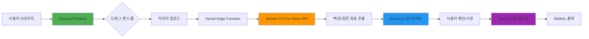

# TRD (Technical Requirements Document)

## 프로젝트 개요

### 서비스명
Space Moduler (가제)

### 기술적 목표
> **"클라이언트 사이드 3D 렌더링 + AI Vision API를 활용한 서버리스 아키텍처"**

---

## 기술 스택

### 프론트엔드

| 카테고리 | 기술 | 버전 | 사유 |
|----------|------|------|------|
| **프레임워크** | Next.js | 15.x | App Router, RSC, Vercel 배포 용이 |
| **언어** | TypeScript | 5.x | 타입 안전성 |
| **2D 그래픽** | Konva.js | 9.x | Canvas 기반 2D 그래픽, 사용자 수정 용이 |
| **3D 렌더링** | Three.js | 0.160.x | WebGL 기반 3D 렌더링 |
| **3D 헬퍼** | @react-three/fiber | 8.x | React + Three.js 통합 |
| **3D DND** | @react-three/drei | 9.x | 3D 상호작용 헬퍼 |
| **상태 관리** | Zustand | 4.x | 가벼운 상태 관리 |
| **스타일** | Tailwind CSS | 3.x | 유틸리티 우선 |
| **HTTP 클라이언트** | Axios | 1.x | API 호출 |

### 백엔드 (서버리스)

| 카테고리 | 기술 | 버전 | 사유 |
|----------|------|------|------|
| **런타임** | Node.js Edge Runtime | - | Vercel Edge Functions |
| **AI API** | Gemini 3.0 Pro Vision | - | 평면도 분석 |
| **파일 저장** | Vercel Blob | - | 이미지 일시 저장 (선택적) |
| **CDN** | Vercel Edge Network | - | 전역 배포 |

### 인프라

| 카테고리 | 기술 | 사유 |
|----------|------|------|
| **호스팅** | Vercel | 무료 플랜으로 시작, Edge Functions 지원 |
| **도메인** | (추후) | Vercel 무료 도메인 또는 별도 구매 |
| **모니터링** | Vercel Analytics | 무료, 사용자 추적 |
| **에러 트래킹** | (추후) | Sentry 또는 Vercel Log Drains |

---

## 아키텍처

### 시스템 아키텍처



### 레이어 구조

```
┌─────────────────────────────────────────────────────────┐
│                    Presentation Layer                    │
│  ┌──────────────┐  ┌──────────────┐  ┌──────────────┐  │
│  │   Next.js    │  │  Konva.js    │  │   Three.js   │  │
│  │   Pages      │  │   2D View    │  │   3D View    │  │
│  └──────────────┘  └──────────────┘  └──────────────┘  │
├─────────────────────────────────────────────────────────┤
│                    Application Layer                     │
│  ┌──────────────┐  ┌──────────────┐  ┌──────────────┐  │
│  │   Zustand    │  │  Hooks       │  │  Utils       │  │
│  │   State      │  │  (usePlan2D) │  │  (convert3D) │  │
│  └──────────────┘  └──────────────┘  └──────────────┘  │
├─────────────────────────────────────────────────────────┤
│                    Integration Layer                     │
│  ┌──────────────┐  ┌──────────────┐  ┌──────────────┐  │
│  │   API Client │  │  Gemini      │  │  Storage     │  │
│  │   (Axios)    │  │  Service     │  │  (Vercel)    │  │
│  └──────────────┘  └──────────────┘  └──────────────┘  │
├─────────────────────────────────────────────────────────┤
│                     External APIs                        │
│  ┌──────────────┐  ┌──────────────┐                     │
│  │  Gemini 3.0  │  │   Vercel     │                     │
│  │  Vision API  │  │   Blob       │                     │
│  └──────────────┘  └──────────────┘                     │
└─────────────────────────────────────────────────────────┘
```

---

## 핵심 컴포넌트

### 1. 이미지 업로드

**기술:** HTML5 Drag & Drop API + FormData

```typescript
interface UploadedImage {
  file: File;
  url: string;
  width: number;
  height: number;
}
```

**구현 포인트:**
- 드래그 앤 드롭 이벤트 핸들링
- 이미지 미리보기 (FileReader)
- 파일 크기/형식 검증 (JPG, PNG, PDF, 최대 10MB)

### 2. Gemini Vision API 연동

**기술:** Google Generative AI SDK

```typescript
interface PlanAnalysis {
  walls: Wall[];
  doors: Door[];
  windows: Window[];
  rooms: Room[];
  dimensions: {
    width: number;
    height: number;
    scale: number; // 픽셀 -> 미터 변환 비율
  };
}
```

**API 엔드포인트:**
```
POST /api/analyze-plan
Content-Type: multipart/form-data

Request:
{
  image: File
}

Response:
{
  success: boolean;
  data?: PlanAnalysis;
  error?: string;
}
```

**프롬프트 전략:**
```
이 평면도 이미지를 분석해서:
1. 벽의 좌표 (시작점, 끝점, 두께)
2. 문의 위치 (좌표, 방향, 크기)
3. 창문의 위치 (좌표, 방향, 크기)
4. 방의 구분 (공간 이름, 면적)

JSON 형식으로 반환해주세요.
```

### 3. Konva.js 2D 프리뷰

**기술:** Konva.js + React-Konva

```typescript
interface Plan2DState {
  walls: Wall[];
  doors: Door[];
  windows: Window[];
  selectedElement?: string;
  scale: number;
  offset: { x: number; y: number };
}
```

**구현 포인트:**
- 캔버스 위에 평면도 이미지 배경
- 벽/문/창문을 레이어로 오버레이
- 클릭/드래그으로 요소 선택 및 수정
- 줌/팬 기능

### 4. Three.js 3D 렌더링

**기술:** Three.js + React Three Fiber

```typescript
interface Scene3DConfig {
  walls: Mesh[];
  doors: Mesh[];
  windows: Mesh[];
  floor: Mesh;
  lighting: {
    ambient: number;
    directional: { intensity: number; position: Vector3 };
  };
  camera: {
    position: Vector3;
    target: Vector3;
  };
}
```

**변환 로직:**
```
2D 좌표 → 3D 좌표
(x, y) → (x, 0, -y)

벽: 2D 선분 → 3D BoxGeometry (높이 2.5m)
문: 2D 직사각형 → 3D BoxGeometry (높이 2.1m)
창문: 2D 직사각형 → 3D BoxGeometry (높이 1.5m, 바닥에서 1m)
바닥: 방 경계 → 3D PlaneGeometry
```

**구현 포인트:**
- OrbitControls (회전, 줌, 이동)
- 그림자 활성화
- 조명 (Ambient + Directional)
- 안티앨리어싱

---

## 데이터 모델

### Core Types

```typescript
// 2D 기하학
interface Point2D {
  x: number;
  y: number;
}

interface Line2D {
  start: Point2D;
  end: Point2D;
  thickness: number;
}

// 3D 기하학
interface Point3D {
  x: number;
  y: number;
  z: number;
}

// 평면도 요소
interface Wall {
  id: string;
  start: Point2D;
  end: Point2D;
  thickness: number; // 미터
  height: number; // 기본 2.5m
}

interface Door {
  id: string;
  position: Point2D;
  width: number; // 미터
  direction: 'horizontal' | 'vertical';
  opens: 'left' | 'right' | 'both';
}

interface Window {
  id: string;
  position: Point2D;
  width: number;
  height: number; // 기본 1.5m
  fromFloor: number; // 바닥에서 높이, 기본 1m
}

interface Room {
  id: string;
  name: string; // "거실", "안방" 등
  boundary: Point2D[];
  area: number; // 제곱미터
}

// 전체 평면도
interface FloorPlan {
  id: string;
  name: string;
  walls: Wall[];
  doors: Door[];
  windows: Window[];
  rooms: Room[];
  metadata: {
    originalImage: string; // URL
    scale: number; // 픽셀 -> 미터
    createdAt: Date;
    updatedAt: Date;
  };
}
```

---

## API 설계

### REST API

#### 1. 평면도 분석

```http
POST /api/analyze-plan
```

**Request:**
```typescript
{
  image: File; // FormData
}
```

**Response:**
```typescript
{
  success: true;
  data: {
    walls: Wall[];
    doors: Door[];
    windows: Window[];
    rooms: Room[];
    dimensions: {
      width: number;
      height: number;
      scale: number;
    };
  };
}
```

#### 2. 이미지 업로드 (선택적 저장)

```http
POST /api/upload-image
```

**Request:**
```typescript
{
  image: File;
  save: boolean; // 사용자 동의 여부
}
```

**Response:**
```typescript
{
  success: true;
  data: {
    url: string;
    expiresAt?: Date; // 저장 안 하면 1시간 후 만료
  };
}
```

#### 3. 평면도 저장 (선택적)

```http
POST /api/save-plan
```

**Request:**
```typescript
{
  plan: FloorPlan;
}
```

**Response:**
```typescript
{
  success: true;
  data: {
    id: string;
    shareUrl: string;
  };
}
```

---

## 상태 관리

### Zustand Store 구조

```typescript
interface AppStore {
  // UI 상태
  ui: {
    currentView: 'upload' | '2d-preview' | '3d-view';
    isLoading: boolean;
    loadingMessage: string;
    sidebarOpen: boolean;
  };

  // 데이터 상태
  plan: {
    originalImage: string | null;
    analysis: PlanAnalysis | null;
    plan2D: FloorPlan | null;
    plan3D: Scene3DConfig | null;
  };

  // 사용자 설정
  settings: {
    unit: 'metric' | 'imperial';
    theme: 'light' | 'dark';
    autoSave: boolean;
  };

  // 액션
  actions: {
    setView: (view: 'upload' | '2d-preview' | '3d-view') => void;
    setLoading: (loading: boolean, message?: string) => void;
    setOriginalImage: (image: string) => void;
    setAnalysis: (analysis: PlanAnalysis) => void;
    updatePlan2D: (updates: Partial<FloorPlan>) => void;
    regenerate3D: () => void;
  };
}
```

---

## 성능 최적화

### 1. AI API 호출 최적화

**전략:**
- 이미지 리사이징 (최대 2048x2048)
- 캐싱 (동일 이미지 재요청 시 로컬 저장소 활용)
- 요청 디바운싱

```typescript
const analyzePlan = cache(async (image: File) => {
  // 캐시 확인
  const cached = await getFromCache(image);
  if (cached) return cached;

  // 리사이징
  const resized = await resizeImage(image, 2048);

  // API 호출
  const result = await callGeminiAPI(resized);

  // 캐시 저장
  await saveToCache(image, result);

  return result;
});
```

### 2. 3D 렌더링 최적화

**전략:**
- Geometry 인스턴싱 (동일한 벽/문 재사용)
- LOD (Level of Detail) - 먼 물체는 단순화
- 프레임 레이트 제한 (30fps)

```typescript
// 벽 인스턴싱
const wallGeometry = new BoxGeometry(1, WALL_HEIGHT, 1);
const wallMaterial = new MeshStandardMaterial();

walls.forEach(wall => {
  const instancedWall = new Mesh(wallGeometry, wallMaterial);
  instancedWall.position.set(wall.x, WALL_HEIGHT / 2, wall.z);
  instancedWall.scale.set(wall.length, 1, wall.thickness);
  scene.add(instancedWall);
});
```

### 3. 코드 스플리팅

```typescript
// 다이나믹 임포트
const ThreeViewer = dynamic(() => import('@/components/3D/ThreeViewer'), {
  loading: () => <LoadingSpinner />,
  ssr: false, // WebGL은 클라이언트 전용
});
```

---

## 보안

### 1. API 키 보호
- Gemini API 키는 서버 환경 변수로 관리
- 클라이언트에 노출되지 않도록 Edge Function 경유

```env
# .env.local (서버 전용)
GEMINI_API_KEY=your_api_key_here
```

### 2. 파일 업로드 검증
- 파일 형식 검증 (Magic Number)
- 파일 크기 제한 (10MB)
- 바이러스 스캔 (Vercel Blob 기본 기능)

### 3. CORS 설정
```typescript
// next.config.js
module.exports = {
  async headers() {
    return [
      {
        source: '/api/:path*',
        headers: [
          { key: 'Access-Control-Allow-Origin', value: 'https://yourdomain.com' },
        ],
      },
    ];
  },
};
```

---

## 테스트 전략

### 단위 테스트
- 유틸리티 함수 (2D → 3D 변환)
- 상태 관리 로직

### 통합 테스트
- API 엔드포인트
- 컴포넌트 상호작용

### E2E 테스트
- 전체 사용자 플로우

```typescript
// 예시: 평면도 변환 E2E
test('사용자가 평면도를 업로드하고 3D를 본다', async () => {
  // 1. 이미지 드래그 앤 드롭
  await dragAndDrop('test-plan.jpg');

  // 2. 분석 완료 대기
  await waitForElement('[data-testid="2d-preview"]');

  // 3. 2D 확인 후 3D 버튼 클릭
  await click('[data-testid="generate-3d"]');

  // 4. 3D 렌더링 확인
  await waitForElement('[data-testid="3d-viewer"]');
});
```

---

## 배포 전략

### Vercel 배포 설정

```json
{
  "buildCommand": "npm run build",
  "devCommand": "npm run dev",
  "installCommand": "npm install",
  "framework": "nextjs",
  "regions": ["icn1"], // 서울 리전
  "functions": {
    "api/**/*.ts": {
      "maxDuration": 30 // AI 처리 시간 고려
    }
  }
}
```

### 환경 변수

```env
# Production
GEMINI_API_KEY=your_production_key
NEXT_PUBLIC_APP_URL=https://yourdomain.com
```

---

## 모니터링

### Vercel Analytics
- 페이지 뷰
- Core Web Vitals (LCP, FID, CLS)

### 커스텀 이벤트
- 평면도 업로드 수
- AI 분석 성공/실패률
- 3D 생성 시간

```typescript
// 예시: 분석 시간 추적
analytics.track('plan_analyzed', {
  duration: analysisTime,
  success: true,
  wallCount: walls.length,
});
```

---

## 기술 부채 관리

### 현재 추정치
| 항목 | 상태 |
|------|------|
| 타입 안전성 | TypeScript 엄격 모드 |
| 테스트 커버리지 | 목표 60% |
| 접근성 | WCAG 2.1 AA 목표 |
| 브라우저 지원 | 최신 2버전 |

### 향후 개선
- 서버 사이드 렌더링 최적화
- PWA (Progressive Web App)
- 오프라인 지원 (Service Worker)

---

## 변경 이력

| 버전 | 날짜 | 변경 내용 | 작성자 |
|------|------|----------|--------|
| 1.0 | 2026-01-18 | 초안 작성 | Claude (Socrates) |
