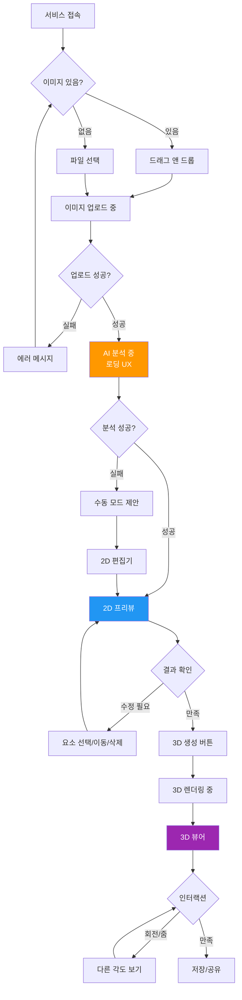

# User Flow

## 서비스명
Space Moduler

## 개요
사용자가 서비스에 접속해서 3D 평면도를 얻기까지의 전체 여정

---

## 전체 사용자 플로우



---

## 단계별 상세 플로우

### Phase 1: 이미지 업로드

#### 1.1 랜딩 페이지

**화면 구성:**
```
┌─────────────────────────────────────────────────────┐
│              Space Moduler                          │
│                                                     │
│  ┌─────────────────────────────────────────────┐   │
│  │                                             │   │
│  │         📸                                   │   │
│  │                                             │   │
│  │    평면도 이미지를 여기에 드래그하세요          │   │
│  │                                             │   │
│  │    또는                                      │   │
│  │    [파일 선택] 버튼 클릭                     │   │
│  │                                             │   │
│  └─────────────────────────────────────────────┘   │
│                                                     │
│  지원 형식: JPG, PNG, PDF (최대 10MB)              │
└─────────────────────────────────────────────────────┘
```

**사용자 행동:**
1. 평면도 이미지를 드래그하여 드롭
2. 또는 "파일 선택" 버튼 클릭하여 파일 선택

**시스템 응답:**
- 드래그 중: 영역 하이라이트
- 파일 선택: 파일 선택 다이얼로그 오픈
- 파일 선택 후: 즉시 업로드 시작

#### 1.2 업로드 검증

**검증 항목:**
| 항목 | 조건 | 실패 시 |
|------|------|---------|
| 파일 형식 | JPG, PNG, PDF | "지원하지 않는 형식입니다" |
| 파일 크기 | ≤ 10MB | "파일이 너무 큽니다 (최대 10MB)" |
| 이미지 너비 | ≥ 500px | "이미지 해상도가 너무 낮습니다" |

**성공 시:**
```typescript
// 파일 정보 표시
파일명: apartment-plan.jpg
크기: 2.4 MB
해상도: 1920 x 1080

[업로드 중...] ████░░░░ 60%
```

---

### Phase 2: AI 분석 (로딩 UX)

#### 2.1 로딩 화면

**화면 구성:**
```
┌─────────────────────────────────────────────────────┐
│                                                     │
│                                                     │
│              AI가 평면도를 분석 중입니다              │
│                                                     │
│                                                     │
│    ┌─────────────────────────────────────────┐     │
│    │                                         │     │
│    │      [애니메이션: 스캔 효과]            │     │
│    │                                         │     │
│    └─────────────────────────────────────────┘     │
│                                                     │
│    벽을 찾는 중...                                  │
│    ████░░░░░░░░░░░░░░                              │
│                                                     │
│    예상 시간: 15초                                  │
│                                                     │
└─────────────────────────────────────────────────────┘
```

**로딩 메시지 변화 (타임라인):**
```
0~5초:   "벽을 찾는 중..."
5~10초:  "문과 창문을 찾는 중..."
10~15초: "공간을 분석하는 중..."
15초~:   "거의 완료..."
```

**기술:**
- 진행 바는 실제 진행도가 아니라 예상 시간 기반 애니메이션
- 실제 완료 시점은 API 응답 시점

#### 2.2 분석 실패 시

**화면 구성:**
```
┌─────────────────────────────────────────────────────┐
│                                                     │
│  ⚠️  분석에 실패했습니다                               │
│                                                     │
│  평면도가 너무 복잡하거나 흐릿할 수 있습니다.          │
│                                                     │
│  [수동으로 그리기]    [다시 시도]                    │
│                                                     │
└─────────────────────────────────────────────────────┘
```

**사용자 옵션:**
1. **다시 시도**: 다른 이미지 업로드
2. **수동으로 그리기**: 2D 편집기로 이동 (빈 캔버스)

---

### Phase 3: 2D 프리뷰

#### 3.1 2D 프리뷰 화면

**화면 구성:**
```
┌─────────────────────────────────────────────────────┐
│  [←] 2D 프리뷰                  [수정 완료] [3D→]  │
├─────────────────────────────────────────────────────┤
│                                                      │
│    ┌─────┬────────────────────────────┬──────┐    │
│     ◑   │                            │  ◑   │    │
│    [벽] │      [캔버스 영역]          │[창문] │    │
│         │      ┌─────────┐           │       │    │
│         │      │  평면도  │           │       │    │
│         │      │  배경    │           │       │    │
│         │      └─────────┘           │       │    │
│         │   ┌──────────────┐         │       │    │
│         │   │ 인식된 벽    │         │       │    │
│         │   └──────────────┘         │       │    │
│         │                            │       │    │
│    └─────┴────────────────────────────┴──────┘    │
│                                                      │
│  [줌 아웃]  [100%]  [줌 인]   [초기화]               │
└─────────────────────────────────────────────────────┘
│                                                      │
│  📋 도구:                                             │
│  ┌─────┐ ┌─────┐ ┌─────┐ ┌─────┐ ┌─────┐         │
│  │ 벽  │ │ 문  │ │창문 │ │방만들기│ │삭제 │         │
│  └─────┘ └─────┘ └─────┘ └─────┘ └─────┘         │
└─────────────────────────────────────────────────────┘
```

#### 3.2 인터랙션

**기본 인터랙션:**
| 행동 | 결과 |
|------|------|
| 캔버스 드래그 | 팬 (이동) |
| 마우스 휠 | 줌 인/아웃 |
| 요소 클릭 | 선택 (하이라이트) |
| 선택 후 드래그 | 요소 이동 |
| Delete 키 | 선택 요소 삭제 |

**도구 사용:**
| 도구 | 사용법 |
|------|--------|
| 벽 | 클릭-드래그로 벽 그리기 |
| 문 | 클릭으로 배치, 회전 핸들로 방향 조정 |
| 창문 | 클릭으로 배치 |
| 방만들기 | 벽으로 둘러싸인 영역 자동 인식 |
| 삭제 | 선택 요소 삭제 |

#### 3.3 수정 플로우

**예시: 벽 수정**
```
1. [벽] 도구 선택
2. 캔버스에서 벽 클릭
   → 벽이 파란색으로 하이라이트
   → 핸들 표시 (시작점, 끝점)

3. 핸들 드래그하여 위치/길이 조정
   → 실시간으로 업데이트

4. [확인] 또는 다른 곳 클릭으로 완료
```

#### 3.4 완료 확인

**화면 구성:**
```
┌─────────────────────────────────────────────────────┐
│  ✓ 2D 프리뷰 완료                                   │
│                                                     │
│  인식된 요소:                                        │
│  • 벽: 12개                                         │
│  • 문: 3개                                          │
│  • 창문: 5개                                         │
│  • 방: 4개                                          │
│                                                     │
│  [다시 수정]  [3D로 변환 →]                         │
└─────────────────────────────────────────────────────┘
```

---

### Phase 4: 3D 렌더링

#### 4.1 3D 생성 중

**화면 구성:**
```
┌─────────────────────────────────────────────────────┐
│                                                     │
│              3D를 생성하는 중입니다                   │
│                                                     │
│    ┌─────────────────────────────────────────┐     │
│    │                                         │     │
│    │      [애니메이션: 3D 모델 조립]          │     │
│    │                                         │     │
│    └─────────────────────────────────────────┘     │
│                                                     │
│    바닥을 만드는 중...                              │
│    ████████░░░░░░░░░░░░░                           │
│                                                     │
└─────────────────────────────────────────────────────┘
```

**메시지 변화:**
```
0~3초:   "바닥을 만드는 중..."
3~6초:   "벽을 세우는 중..."
6~9초:   "문과 창문을 배치하는 중..."
9~12초:  "조명을 설정하는 중..."
완료:    "완료!"
```

#### 4.2 3D 뷰어

**화면 구성:**
```
┌─────────────────────────────────────────────────────┐
│  [←] 3D 뷰어          [저장] [공유] [설정 ⚙️]      │
├─────────────────────────────────────────────────────┤
│                                                      │
│                  ┌─────────────┐                   │
│                 ╱             ╲                    │
│                │   🏠 3D      │                   │
│                │   뷰어       │                   │
│                ╲             ╱                    │
│                 └─────────────┘                   │
│                                                      │
│  [인터랙션 가이드]                                   │
│  • 드래그: 회전                                      │
│  • 스크롤: 줌                                       │
│  • Shift+드래그: 이동                                │
│                                                      │
└─────────────────────────────────────────────────────┘
│                                                      │
│  🎛️  컨트롤:                                         │
│  ┌───────────┐ ┌───────────┐ ┌───────────┐        │
│  │상단 뷰    │ │정면 뷰    │ │3D 뷰      │        │
│  └───────────┘ └───────────┘ └───────────┘        │
└─────────────────────────────────────────────────────┘
```

#### 4.3 3D 인터랙션

| 행동 | 결과 |
|------|------|
| 마우스 드래그 | 카메라 회전 (Orbit) |
| 마우스 휠 | 줌 인/아웃 |
| Shift + 드래그 | 팬 (이동) |
| 요소 클릭 | 정보 팝업 (방 이름, 면적) |

#### 4.4 뷰 모드 전환

**상단 뷰 (Top View):**
```
카메라 위치: (0, 10, 0)
카메라 타겟: (0, 0, 0)
→ 평면도와 유사한 뷰
```

**정면 뷰 (Front View):**
```
카메라 위치: (0, 1.5, 10)
카메라 타겟: (0, 1.5, 0)
→ 사람 시점
```

**3D 뷰 (Perspective):**
```
카메라 위치: (5, 4, 5)
카메라 타겟: (0, 0, 0)
→ 입체감 있는 뷰
```

---

### Phase 5: 저장 및 공유

#### 5.1 저장

**옵션:**
```
┌─────────────────────────────────────────────────────┐
│  💾 3D 모델 저장                                    │
│                                                     │
│  저장 형식을 선택하세요:                             │
│                                                     │
│  ┌─────────────┐  ┌─────────────┐                │
│  │ 📸 이미지    │  │ 🎬 동영상    │                │
│  │             │  │             │                │
│  │ PNG/JPG     │  │ MP4         │                │
│  └─────────────┘  └─────────────┘                │
│                                                     │
│  품질:                                            │
│  ○ 저   ● 중   ○ 고                                │
│                                                     │
│  [취소]  [저장]                                     │
└─────────────────────────────────────────────────────┘
```

#### 5.2 공유

**공유 링크 생성:**
```
┌─────────────────────────────────────────────────────┐
│  🔗 공유 링크                                        │
│                                                     │
│  아래 링크으로 3D를 공유하세요:                      │
│                                                     │
│  ┌─────────────────────────────────────────────┐  │
│  │ https://space-moduler.com/view/abc123       │  │
│  └─────────────────────────────────────────────┘  │
│                                                     │
│  [복사]  [새 탭에서 열기]                           │
└─────────────────────────────────────────────────────┘
```

---

## 에러 플로우

### 에러 유형별 처리

| 에러 | 원인 | 사용자 메시지 | 해결책 |
|------|------|--------------|--------|
| **파일 너무 큼** | > 10MB | "파일이 너무 큽니다" | 파일 압축 안내 |
| **지원 않는 형식** | 비트맵 아님 | "JPG, PNG만 가능합니다" | 변환 안내 |
| **AI 분석 실패** | 이미지 불명확 | "분석에 실패했습니다" | 수동 모드 제안 |
| **3D 렌더링 실패** | 복잡도 초과 | "3D를 생성할 수 없습니다" | 단순화 제안 |
| **저장 실패** | 권한/용량 | "저장에 실패했습니다" | 재시도 안내 |

### 에러 화면 예시

```
┌─────────────────────────────────────────────────────┐
│                                                     │
│              😕 문제가 발생했습니다                   │
│                                                     │
│  파일을 처리하는 중에 오류가 발생했습니다.            │
│                                                     │
│  ┌─────────────────────────────────────────┐       │
│  │ 에러 코드: UPLOAD_SIZE_EXCEEDED          │       │
│  │                                         │       │
│  │ 파일 크기가 10MB를 초과했습니다.         │       │
│  │                                         │       │
│  │ 💡 해결책:                              │       │
│  │ • 이미지를 압축해 보세요                │       │
│  │ • 해상도를 낮춰 보세요                  │       │
│  └─────────────────────────────────────────┘       │
│                                                     │
│  [다른 파일 선택]  [다시 시도]  [고객센터]           │
└─────────────────────────────────────────────────────┘
```

---

## 반응형 디자인

### 데스크톱 (1920x1080)
- 전체 화면 활용
- 사이드바와 메인 캔버스

### 태블릿 (768x1024)
- 세로 모드: 도구가 하단으로
- 가로 모드: 데스크톱과 유사

### 모바일 (375x667) - 미지원
```
┌─────────────────────────────────────────────────────┐
│  ⚠️ 모바일은 아직 지원하지 않습니다                     │
│                                                     │
│  데스크톱이나 태블릿에서 이용해 주세요.                │
│                                                     │
│  [데스크톱 알림 보내기]                               │
└─────────────────────────────────────────────────────┘
```

---

## 접근성

### 키보드 네비게이션
- Tab: 요소 간 이동
- Enter: 선택/확인
- Escape: 취소/뒤로 가기
- Delete: 선택 요소 삭제
- +/-: 줌 인/아웃

### 스크린 리더
```
[평면도 업로드 영역]
"평면도 이미지를 드래그하거나 파일 선택 버튼을 눌러주세요"

[2D 프리뷰 캔버스]
"캔버스 영역. 벽 12개, 문 3개, 창문 5개가 인식되었습니다.
방향키로 이동, Enter로 선택할 수 있습니다."
```

---

## 변경 이력

| 버전 | 날짜 | 변경 내용 | 작성자 |
|------|------|----------|--------|
| 1.0 | 2026-01-18 | 초안 작성 | Claude (Socrates) |
