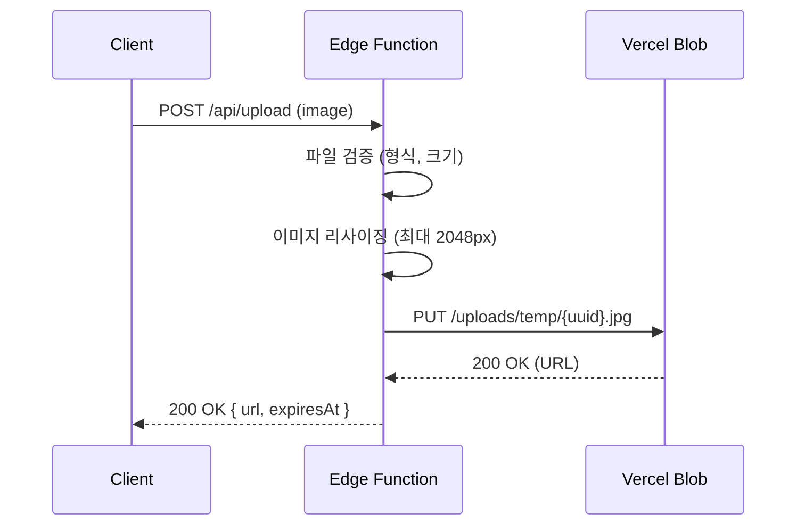
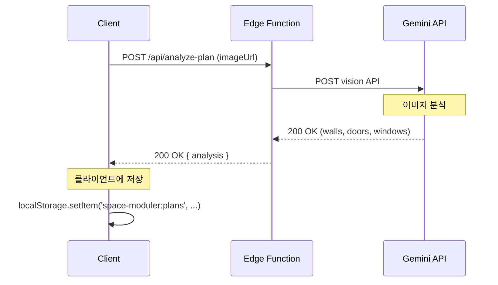
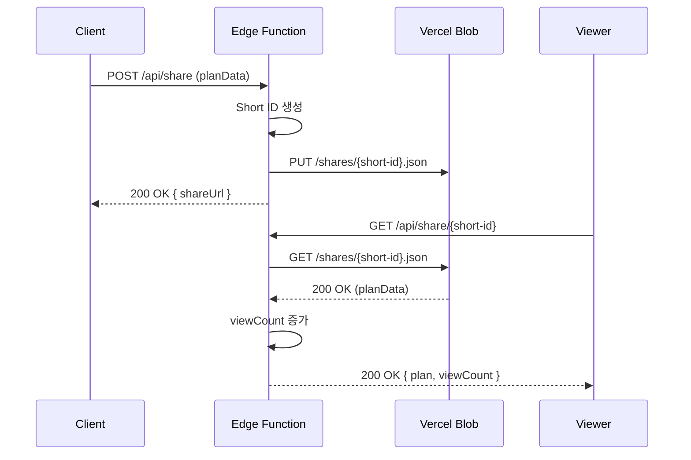

# Database Design

## 서비스명
Space Moduler

## 개요
> **"서버리스 아키텍처를 위한 최소한의 데이터 저장 전략"**

이 프로젝트는 Vercel Blob + Vercel Edge Functions 기반의 서버리스 아키텍처를 사용합니다.
전통적인 RDBMS는 사용하지 않으며, 필요한 경우에만 Vercel Blob (객체 저장소) 또는
간단한 JSON 저장소를 활용합니다.

---

## 데이터 저장 전략

### 저장 대상별 전략

| 데이터 유형 | 저장 방식 | 사유 |
|------------|----------|------|
| **업로드 이미지** | Vercel Blob (임시) | 1시간 후 자동 삭제 |
| **사용자 동의 이미지** | Vercel Blob (영구) | 선택적 저장 |
| **평면도 데이터 (JSON)** | 클라이언트 localStorage | 서버 저장 필요 없음 |
| **공유 링크 데이터** | Vercel Blob (JSON) | 짧은 URL 공유용 |
| **사용자 설정** | 클라이언트 localStorage | 개인화 설정 |

---

## 데이터 모델

### 1. 업로드 이미지 (임시)

**저장소:** Vercel Blob
**수명:** 1시간 (자동 삭제)

```typescript
interface UploadedImageMetadata {
  id: string;           // UUID
  originalName: string; // "apartment-plan.jpg"
  mimeType: string;     // "image/jpeg"
  size: number;         // bytes
  width: number;        // pixels
  height: number;       // pixels
  uploadedAt: Date;
  expiresAt: Date;      // uploadedAt + 1 hour
  url: string;          // Blob URL
}
```

**Blob 경로:**
```
uploads/temp/{year}/{month}/{day}/{uuid}.jpg
```

### 2. 저장된 이미지 (영구)

**저장소:** Vercel Blob
**조건:** 사용자 명시적 동의 시

```typescript
interface SavedImageMetadata extends UploadedImageMetadata {
  userId?: string;      // (추후) 인증 도입 시
  isPublic: boolean;    // 공개 여부
  savedAt: Date;        // 영구 저장 시점
  expiresAt: null;      // 영구
}
```

**Blob 경로:**
```
uploads/images/{year}/{month}/{uuid}.jpg
```

### 3. 평면도 데이터

**저장소:** 클라이언트 localStorage (서버 저장 없음)

```typescript
interface FloorPlanData {
  id: string;           // UUID
  name: string;         // "우리집"
  createdAt: Date;
  updatedAt: Date;

  // 2D 데이터
  walls: Wall[];
  doors: Door[];
  windows: Window[];
  rooms: Room[];

  // 3D 데이터
  camera: {
    position: [number, number, number];
    target: [number, number, number];
  };

  // 메타데이터
  metadata: {
    originalImage: string; // Data URL 또는 Blob URL
    scale: number;         // 픽셀 -> 미터 비율
    unit: 'metric' | 'imperial';
  };
}
```

**localStorage 키:**
```
space-moduler:plans
```

**저장 형식:**
```json
{
  "plans": [
    { "id": "abc123", "name": "우리집", ... },
    { "id": "def456", "name": "새 집", ... }
  ],
  "settings": {
    "unit": "metric",
    "theme": "light"
  }
}
```

### 4. 공유 링크 데이터

**저장소:** Vercel Blob (JSON)
**수명:** 30일 (자동 삭제)

```typescript
interface SharedPlanData {
  id: string;           // Short ID (base62)
  plan: FloorPlanData;  // 평면도 데이터
  thumbnail?: string;   // 썸네일 이미지 URL
  createdAt: Date;
  expiresAt: Date;      // createdAt + 30 days
  viewCount: number;    // 조회 수
}
```

**Blob 경로:**
```
shares/{year}/{month}/{short-id}.json
```

**공유 URL:**
```
https://space-moduler.com/view/{short-id}
```

---

## API 데이터 흐름

### 이미지 업로드 플로우



### 평면도 분석 플로우



### 공유 링크 플로우



---

## 스토리지 크기 추정

### 월간 저장소 사용량

**가정:**
- 일일 사용자: 100명 (3개월 목표)
- 평균 이미지 크기: 2MB (리사이징 후)
- 평균 평면도 JSON 크기: 50KB
- 공유율: 20%

| 항목 | 일일 | 월간 (30일) |
|------|------|-------------|
| 임시 이미지 | 200MB | 6GB (자동 삭제) |
| 영구 이미지 (동의 10%) | 20MB | 600MB |
| 공유 데이터 | 1MB | 30MB |
| **합계** | 221MB | ~6.6GB |

**Vercel Blob 가격:**
- 무료: 1GB
- 유료: $0.15/GB
- 예상 비용: 월 $1 미만

---

## 캐싱 전략

### 클라이언트 사이드 캐시

**localStorage에 캐시:**
```typescript
interface CacheEntry {
  key: string;       // 이미지 URL
  data: FloorPlanData;
  cachedAt: Date;
}

// 캐시 키
space-moduler:cache:{imageUrlHash}
```

**캐시 만료:**
- 이미지 URL 기반: 1시간
- 분석 결과: 7일

### 서버 사이드 캐시

**Edge Function 메모리:**
```typescript
// 간단한 LRU 캐시
const cache = new Map<string, FloorPlanData>();

const MAX_CACHE_SIZE = 100;
const CACHE_TTL = 1000 * 60 * 60; // 1 hour
```

---

## 데이터 백업 및 복구

### 백업 전략

**Vercel Blob → GitHub (주기적)**

```typescript
// 매주 일요일 새벽 2시 실행
export async function backupToGithub() {
  const plans = await listAllSharedPlans();

  const backup = {
    date: new Date(),
    count: plans.length,
    data: plans,
  };

  await commitToRepo('backups', backup);
}
```

### 복구 전략

**GitHub → Vercel Blob**

```typescript
export async function restoreFromBackup(date: string) {
  const backup = await getFromRepo('backups', date);

  for (const plan of backup.data) {
    await uploadToBlob(`shares/${plan.id}.json`, plan);
  }
}
```

---

## 데이터 마이그레이션

### 버전 관리

**데이터 구조 버전:**
```typescript
interface FloorPlanDataV1 {
  version: 'v1';
  // ... v1 필드
}

interface FloorPlanDataV2 {
  version: 'v2';
  // ... v1 필드
  // ... v2 추가 필드
}
```

**마이그레이션 함수:**
```typescript
function migrate(data: any): FloorPlanData {
  if (data.version === 'v1') {
    return {
      ...data,
      version: 'v2',
      // v2 기본값 추가
      metadata: {
        ...data.metadata,
        unit: 'metric',
      },
    };
  }

  return data;
}
```

---

## 보안 및 개인정보

### 데이터 암호화

**전송 중:** HTTPS (TLS 1.3)

**저장 시:**
- 이미지: Vercel Blob 기본 암호화
- JSON: 민감 정보 없음 (평문 저장)

### GDPR/개인정보보호

**사용자 권리:**
| 권리 | 구현 |
|------|------|
| **접근권** | /api/my-data 엔드포인트 |
| **삭제권** | localStorage.clear() |
| **이동권** | JSON 다운로드 |

**데이터 최소화:**
- IP 주소 저장 안 함
- 사용자 식별 정보 저장 안 함 (인증 전)
- 분석용 익명화만 수행

---

## 모니터링

### 저장소 모니터링

**Vercel Dashboard:**
- Blob 사용량
- 대역폭 사용량
- API 호출 수

**커스텀 메트릭:**
```typescript
interface StorageMetrics {
  date: Date;
  totalImages: number;
  totalSize: number;
  averageImageSize: number;
  sharedPlans: number;
  expiredItems: number;
}
```

### 알림

**임계값:**
- 저장소 사용량 > 80%
- API 실패률 > 5%
- 평균 응답 시간 > 3초

---

## Future: 인증 도입 시

### 사용자 데이터 구조 (추후)

```typescript
interface User {
  id: string;
  email: string;
  createdAt: Date;
  plans: string[];     // Plan IDs
  settings: UserSettings;
}

interface UserSettings {
  unit: 'metric' | 'imperial';
  theme: 'light' | 'dark';
  autoSave: boolean;
  notifications: boolean;
}
```

### 저장소 변경

```
localStorage → Supabase / Firebase Auth
```

---

## 변경 이력

| 버전 | 날짜 | 변경 내용 | 작성자 |
|------|------|----------|--------|
| 1.0 | 2026-01-18 | 초안 작성 | Claude (Socrates) |
