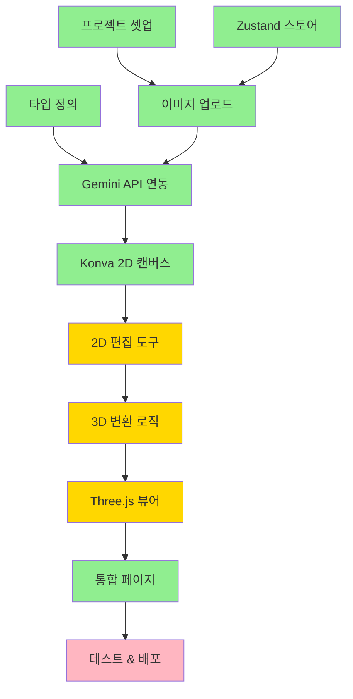

# TASKS: Space Moduler

## 프로젝트 개요

**서비스명**: Space Moduler (가제)
**목표**: 2D 평면도 이미지를 드래그 앤 드롭 하나로 3D 렌더링해주는 웹 서비스
**개발 기간**: 3개월 (MVP)
**기술 스택**: Next.js 15, TypeScript, Konva.js, Three.js, Gemini 2.0 Flash API

---

## 프로젝트 현황 분석

### 감지된 기술 스택
- **프론트엔드**: Next.js 15, React 19, TypeScript
- **상태 관리**: Zustand
- **2D 그래픽**: Konva.js, react-konva
- **3D 그래픽**: Three.js, @react-three/fiber, @react-three/drei
- **스타일링**: Tailwind CSS
- **AI API**: Gemini 2.0 Flash Exp (Vision)

### 구현 현황 요약

| 영역 | 상태 | 파일 수 | 테스트 |
|------|------|---------|--------|
| 프로젝트 셋업 | ✅ 완료 | 10 | ❌ |
| 타입 정의 | ✅ 완료 | 6 | ❌ |
| 상태 관리 | ✅ 완료 | 1 | ❌ |
| UI 컴포넌트 (Landing/Analysis) | ✅ 완료 | 2 | ❌ |
| 이미지 업로드 | ✅ 완료 | 1 | ❌ |
| Gemini API 연동 | ✅ 완료 | 1 | ❌ |
| 2D 캔버스 (Konva) | ✅ 완료 | 2 | ❌ |
| 2D 편집 도구 | ⚠️ 부분 | 1 | ❌ |
| 3D 씬 (Three.js) | ✅ 완료 | 5 | ❌ |
| 3D 모델 변환 | ⚠️ 부분 | 1 | ❌ |
| 3D 뷰어 컨트롤 | ⚠️ 부분 | 1 | ❌ |
| 통합 페이지 | ✅ 완료 | 4 | ❌ |
| 테스트 | ❌ 미시작 | 0 | ❌ |
| 배포 | ❌ 미시작 | - | - |

### 발견된 TODO/FIXME
- 없음

---

## 마일스톤 개요

| 마일스톤 | 설명 | 기간 | 상태 |
|----------|------|------|------|
| **M0** | 프로젝트 셋업 | Week 1-2 | ✅ 완료 |
| **M1** | 이미지 업로드 & Gemini API 연동 | Week 3-4 | ✅ 완료 |
| **M2** | Konva.js 2D 프리뷰 | Week 5-6 | ⚠️ 진행중 |
| **M3** | Three.js 3D 렌더링 | Week 7-8 | ⚠️ 진행중 |
| **M4** | 통합, 테스트, 배포 | Week 9-10 | ❌ 미시작 |

---

## 의존성 그래프



---

## M0: 프로젝트 셋업 (Phase 0) ✅

### [x] Phase 0, T0.1: Next.js 프로젝트 초기화
**상태**: 완료됨
**근거**: package.json, next.config.js, tsconfig.json 존재
**파일**:
- `package.json`
- `next.config.js`
- `tsconfig.json`
- `tailwind.config.ts`
- `.eslintrc.json`
- `.prettierrc`

### [x] Phase 0, T0.2: 공통 타입 정의
**상태**: 완료됨
**근거**: types/ 디렉토리에 모든 타입 정의 완료
**파일**:
- `types/geometry.ts`
- `types/geometry-3d.ts`
- `types/floor-plan.ts`
- `types/api.ts`
- `types/store.ts`
- `types/index.ts`

### [x] Phase 0, T0.3: Zustand 스토어 구조 설정
**상태**: 완료됨
**근거**: lib/store.ts 존재
**파일**: `lib/store.ts`

---

## M1: 이미지 업로드 & Gemini API 연동 (Phase 1) ✅

### [x] Phase 1, T1.1: 이미지 업로드 컴포넌트
**상태**: 완료됨
**근거**: components/ui/ImageUpload.tsx 존재, 드래그 앤 드롭 구현됨
**파일**:
- `components/ui/ImageUpload.tsx`
- `lib/utils/imageValidation.ts`

### [x] Phase 1, T1.2: Gemini Vision API 연동
**상태**: 완료됨
**근거**: app/api/analyze-plan/route.ts 존재, Gemini 2.0 Flash Exp 사용
**파일**:
- `app/api/analyze-plan/route.ts`
- `lib/api/gemini.ts`

### [x] Phase 1, T1.3: 로딩 UX 컴포넌트
**상태**: 완료됨
**근거**: components/ui/LoadingScreen.tsx 존재
**파일**:
- `components/ui/LoadingScreen.tsx`

---

## M2: Konva.js 2D 프리뷰 (Phase 2) ⚠️

### [x] Phase 2, T2.1: Konva 캔버스 기본 구조
**상태**: 완료됨
**근거**: components/2d/Canvas.tsx 존재, 줌/팬 기능 구현됨
**파일**:
- `components/2d/Canvas.tsx`
- `hooks/useCanvas.ts`

### [ ] Phase 2, T2.2: 2D 편집 도구 완성
**상태**: 부분 구현
**근거**: components/2d/ToolBar.tsx 존재하지만 미구현 부분 있음
**파일**:
- `components/2d/ToolBar.tsx`
**TODO**:
- 요소 선택/하이라이트 기능 완성
- 이동/삭제 기능 완성
- 핸들로 위치/길이 조정 기능 추가

### [x] Phase 2, T2.3: 2D → 3D 변환 로직
**상태**: 완료됨
**근거**: lib/utils/conversion.ts 존재
**파일**:
- `lib/utils/conversion.ts`

---

## M3: Three.js 3D 렌더링 (Phase 3) ⚠️

### [x] Phase 3, T3.1: Three.js 기본 씬 설정
**상태**: 완료됨
**근거**: components/3d/Scene.tsx 존재, OrbitControls 구현됨
**파일**:
- `components/3d/Scene.tsx`

### [x] Phase 3, T3.2: 3D 모델 생성
**상태**: 완료됨
**근거**: 모든 Mesh 컴포넌트 구현됨
**파일**:
- `components/3d/WallMesh.tsx`
- `components/3d/DoorMesh.tsx`
- `components/3d/WindowMesh.tsx`
- `components/3d/FloorMesh.tsx`

### [ ] Phase 3, T3.3: 3D 뷰어 컨트롤 완성
**상태**: 부분 구현
**근거**: ViewModeSelector 있지만 useState import 누락 등 이슈 있음
**파일**:
- `components/3d/ViewModeSelector.tsx`
**TODO**:
- useState import 추가
- 카메라 전환 애니메이션 완성
- 요소 클릭 시 정보 팝업 추가

---

## M4: 통합, 테스트, 배포 (Phase 4) ⚠️

### [x] Phase 4, T4.1: 전체 플로우 통합
**상태**: 완료됨
**근거**: 모든 페이지 컴포넌트와 라우팅 구현됨
**파일**:
- `app/page.tsx`
- `components/screens/LandingPage.tsx`
- `components/screens/AnalysisPage.tsx`
- `components/screens/EditorPage.tsx`
- `components/screens/ViewerPage.tsx`

### [ ] Phase 4, T4.2: 테스트 작성 및 통과
**상태**: 미시작
**담당**: test-specialist
**TODO**:
- 단위 테스트 작성 (커버리지 >= 60%)
- 통합 테스트 작성
- E2E 테스트 작성

### [ ] Phase 4, T4.3: 배포 및 모니터링 설정
**상태**: 미시작
**담당**: frontend-specialist
**TODO**:
- Vercel 프로덕션 배포
- 환경 변수 설정
- Analytics 설정

---

## 다음 우선순위 작업

1. **T3.3**: 3D 뷰어 컨트롤 완성 (ViewModeSelector 수정)
2. **T2.2**: 2D 편집 도구 완성 (요소 선택/이동/삭제)
3. **T4.2**: 테스트 작성 (단위/통합/E2E)
4. **T4.3**: 배포 및 모니터링 설정

---

## 환경 변수

```env
# .env.local (서버 전용)
GEMINI_API_KEY=your_api_key_here

# .env.local (클라이언트)
NEXT_PUBLIC_APP_URL=http://localhost:3000
```

---

## 의존성 패키지

```json
{
  "dependencies": {
    "next": "^15.0.0",
    "react": "^19.0.0",
    "typescript": "^5.0.0",
    "@react-three/fiber": "^8.0.0",
    "@react-three/drei": "^9.0.0",
    "three": "^0.160.0",
    "konva": "^9.0.0",
    "react-konva": "^18.0.0",
    "zustand": "^4.0.0",
    "@google/generative-ai": "^0.1.0",
    "tailwindcss": "^3.0.0"
  }
}
```

---

## 변경 이력

| 버전 | 날짜 | 변경 내용 | 작성자 |
|------|------|----------|--------|
| 1.0 | 2026-01-18 | TASKS.md 생성 | Claude (Tasks Generator) |
| 2.0 | 2026-01-18 | 코드 분석 기반 현황 업데이트 | Claude (Tasks Generator) |
