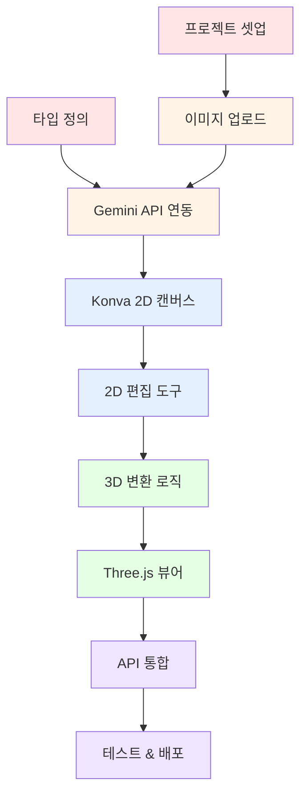

# TASKS: Space Moduler

## 프로젝트 개요

**서비스명**: Space Moduler (가제)
**목표**: 2D 평면도 이미지를 드래그 앤 드롭 하나로 3D 렌더링해주는 웹 서비스
**개발 기간**: 3개월 (MVP)
**기술 스택**: Next.js 15, TypeScript, Konva.js, Three.js, Gemini 3.0 Pro API

---

## 마일스톤 개요

| 마일스톤 | 설명 | 기간 | 상태 |
|----------|------|------|------|
| **M0** | 프로젝트 셋업 | Week 1-2 | ❌ 미시작 |
| **M1** | 이미지 업로드 & Gemini API 연동 | Week 3-4 | ❌ 미시작 |
| **M2** | Konva.js 2D 프리뷰 | Week 5-6 | ❌ 미시작 |
| **M3** | Three.js 3D 렌더링 | Week 7-8 | ❌ 미시작 |
| **M4** | 통합, 테스트, 배포 | Week 9-10 | ❌ 미시작 |

---

## 의존성 그래프



---

## 병렬 실행 가능 태스크

| 태스크 그룹 | 병렬 가능 여부 | 설명 |
|------------|--------------|------|
| {T0.1, T0.2} | ✅ 가능 | 프로젝트 구조와 타입 정의는 독립적 |
| {T1.1, T1.2} | ❌ 불가능 | 업로드 후 API 호출 필요 |
| {T2.1, T2.2} | ❌ 불가능 | 캔버스 후 편집 도구 |
| {T3.1, T3.2} | ❌ 불가능 | 변환 로직 후 뷰어 |

---

## M0: 프로젝트 셋업 (Phase 0)

### [ ] Phase 0, T0.1: Next.js 프로젝트 초기화

**담당**: frontend-specialist

**작업 내용**:
- Next.js 15 + TypeScript 프로젝트 생성
- App Router 구조 설정
- Tailwind CSS 설치 및 설정
- ESLint, Prettier 설정

**산출물**:
- `package.json`
- `next.config.js`
- `tsconfig.json`
- `tailwind.config.ts`
- `.eslintrc.json`
- `.prettierrc`

**디렉토리 구조**:
```
src/
├── app/
│   ├── (main)/
│   │   ├── page.tsx
│   │   ├── layout.tsx
│   │   └── loading.tsx
│   └── api/
├── components/
│   ├── ui/
│   ├── 2d/
│   └── 3d/
├── lib/
│   ├── utils/
│   ├── api/
│   └── store.ts
├── hooks/
├── types/
└── styles/
```

**완료 조건**:
- [ ] `npm run dev`로 개발 서버 실행 가능
- [ ] http://localhost:3000 접속 시 기본 페이지 표시
- [ ] TypeScript 컴파일 에러 없음
- [ ] Tailwind CSS 적용 확인

---

### [ ] Phase 0, T0.2: 공통 타입 정의

**담당**: frontend-specialist

**작업 내용**:
- 기하학 타입 정의 (Point2D, Point3D, Line2D)
- 평면도 요소 타입 정의 (Wall, Door, Window, Room)
- API 요청/응답 타입 정의
- 상태 관리 타입 정의

**산출물**:
- `src/types/geometry.ts`
- `src/types/floor-plan.ts`
- `src/types/api.ts`
- `src/types/store.ts`

**완료 조건**:
- [ ] 모든 타임 정의 완료
- [ ] TypeScript 컴파일 에러 없음
- [ ] 타입 export 정상

---

### [ ] Phase 0, T0.3: Zustand 스토어 구조 설정

**담당**: frontend-specialist

**작업 내용**:
- Zustand 설치
- AppStore 인터페이스 정의
- 초기 스토어 구현
- Persist 미들웨어 설정 (localStorage)

**산출물**:
- `src/lib/store.ts`

**완료 조건**:
- [ ] 스토어 생성 완료
- [ ] localStorage에 자동 저장
- [ ] 타입 안전성 확보

---

### [ ] Phase 0, T0.4: Vercel 배포 설정

**담당**: frontend-specialist

**작업 내용**:
- Vercel 프로젝트 생성
- 환경 변수 설정 (.env.local 템플릿)
- Edge Functions 설정
- Analytics 설정

**산출물**:
- `.env.local.example`
- `vercel.json` (필요시)

**완료 조건**:
- [ ] Vercel에 배포 성공
- [ ] 배포된 사이트 접속 가능

---

## M1: 이미지 업로드 & Gemini API 연동 (Phase 1)

### [ ] Phase 1, T1.1: 이미지 업로드 컴포넌트 RED→GREEN

**담당**: frontend-specialist

**Git Worktree 설정**:
```bash
git worktree add ../project-phase1-upload -b phase/1-upload
cd ../project-phase1-upload
```

**TDD 사이클**:

1. **RED**: 테스트 작성
   ```bash
   # 테스트 파일: src/components/__tests__/ImageUpload.test.tsx
   npm test -- ImageUpload.test.tsx
   ```

2. **GREEN**: 구현
   ```bash
   # 구현 파일: src/components/ui/ImageUpload.tsx
   npm test -- ImageUpload.test.tsx
   ```

3. **REFACTOR**: 리팩토링

**산출물**:
- `src/components/ui/ImageUpload.tsx`
- `src/components/__tests__/ImageUpload.test.tsx`
- `src/lib/utils/imageValidation.ts`

**구현 요구사항**:
- 드래그 앤 드롭 지원
- 파일 선택 버튼 지원
- 파일 형식 검증 (JPG, PNG, PDF)
- 파일 크기 검증 (최대 10MB)
- 이미지 미리보기
- 업로드 진행률 표시

**인수 조건**:
- [ ] 모든 테스트 통과
- [ ] 드래그 앤 드롭 동작 확인
- [ ] 파일 검증 로직 확인
- [ ] 커버리지 >= 80%

**완료 시 자동 실행**:
```bash
git add -A && git commit -m "$(cat <<'EOF'
기능: 이미지 업로드 컴포넌트 구현

- 드래그 앤 드롭 지원
- 파일 형식/크기 검증
- 이미지 미리보기 기능
- 진행률 표시

태스크: Phase 1, T1.1
EOF
)"
git checkout main && git merge phase/1-upload --no-ff -m "병합: Phase 1 - 이미지 업로드"
git worktree remove ../project-phase1-upload && git branch -d phase/1-upload
```

---

### [ ] Phase 1, T1.2: Gemini Vision API 연동 RED→GREEN

**담당**: backend-specialist

**Git Worktree 설정**:
```bash
git worktree add ../project-phase1-gemini -b phase/1-gemini
cd ../project-phase1-gemini
```

**TDD 사이클**:

1. **RED**: 테스트 작성
   ```bash
   # 테스트 파일: src/app/api/analyze-plan/route.test.ts
   npm test -- route.test.ts
   ```

2. **GREEN**: 구현
   ```bash
   # 구현 파일: src/app/api/analyze-plan/route.ts
   npm test -- route.test.ts
   ```

3. **REFACTOR**: 리팩토링

**산출물**:
- `src/app/api/analyze-plan/route.ts`
- `src/lib/api/gemini.ts`
- `src/app/api/analyze-plan/route.test.ts`

**구현 요구사항**:
- Edge Function으로 구현
- Gemini 3.0 Pro Vision API 호출
- 이미지 리사이징 (최대 2048x2048)
- 평면도 분석 프롬프트 작성
- 벽/문/창문 좌표 추출
- 에러 핸들링

**API 스펙**:
```
POST /api/analyze-plan
Request: multipart/form-data { image: File }
Response: {
  success: boolean;
  data?: PlanAnalysis;
  error?: string;
}
```

**인수 조건**:
- [ ] 모든 테스트 통과
- [ ] Edge Function 정상 작동
- [ ] Gemini API 호출 성공
- [ ] 응답 타입 검증
- [ ] 커버리지 >= 80%

**완료 시 자동 실행**:
```bash
git add -A && git commit -m "$(cat <<'EOF'
기능: Gemini Vision API 연동

- 평면도 분석 API 엔드포인트 구현
- 벽/문/창문 자동 인식
- 이미지 리사이징 처리
- 에러 핸들링

태스크: Phase 1, T1.2
EOF
)"
git checkout main && git merge phase/1-gemini --no-ff -m "병합: Phase 1 - Gemini API"
git worktree remove ../project-phase1-gemini && git branch -d phase/1-gemini
```

---

### [ ] Phase 1, T1.3: 로딩 UX 컴포넌트 RED→GREEN

**담당**: frontend-specialist

**Git Worktree 설정**:
```bash
git worktree add ../project-phase1-loading -b phase/1-loading
cd ../project-phase1-loading
```

**TDD 사이클**:

1. **RED**: 테스트 작성
2. **GREEN**: 구현
3. **REFACTOR**: 리팩토링

**산출물**:
- `src/components/ui/LoadingScreen.tsx`
- `src/components/ui/ProgressBar.tsx`

**구현 요구사항**:
- 스캔 애니메이션 효과
- 진행 바 (예상 시간 기반)
- 메시지 변화 (타임라인에 따른)
- 예상 시간 표시

**메시지 타임라인**:
```
0~5초:   "벽을 찾는 중..."
5~10초:  "문과 창문을 찾는 중..."
10~15초: "공간을 분석하는 중..."
15초~:   "거의 완료..."
```

**완료 시 자동 실행**:
```bash
git add -A && git commit -m "기능: 로딩 UX 컴포넌트 구현

태스크: Phase 1, T1.3"
git checkout main && git merge phase/1-loading --no-ff
git worktree remove ../project-phase1-loading && git branch -d phase/1-loading
```

---

## M2: Konva.js 2D 프리뷰 (Phase 2)

### [ ] Phase 2, T2.1: Konva 캔버스 기본 구조 RED→GREEN

**담당**: frontend-specialist

**Git Worktree 설정**:
```bash
git worktree add ../project-phase2-canvas -b phase/2-canvas
cd ../project-phase2-canvas
```

**TDD 사이클**:

1. **RED**: 테스트 작성
2. **GREEN**: 구현
3. **REFACTOR**: 리팩토링

**산출물**:
- `src/components/2d/Canvas.tsx`
- `src/components/2d/Canvas.test.tsx`
- `src/hooks/useCanvas.ts`

**구현 요구사항**:
- Konva.js + React-Konva 설정
- 이미지 배경 레이어
- 벽/문/창문 레이어
- 줌/팬 기능
- 캔버스 크기 반응형

**완료 시 자동 실행**:
```bash
git add -A && git commit -m "기능: Konva 캔버스 기본 구조 구현

태스크: Phase 2, T2.1"
git checkout main && git merge phase/2-canvas --no-ff
git worktree remove ../project-phase2-canvas && git branch -d phase/2-canvas
```

---

### [ ] Phase 2, T2.2: 2D 편집 도구 RED→GREEN

**담당**: frontend-specialist

**Git Worktree 설정**:
```bash
git worktree add ../project-phase2-tools -b phase/2-tools
cd ../project-phase2-tools
```

**TDD 사이클**:

1. **RED**: 테스트 작성
2. **GREEN**: 구현
3. **REFACTOR**: 리팩토링

**산출물**:
- `src/components/2d/ToolBar.tsx`
- `src/components/2d/WallEditor.tsx`
- `src/components/2d/DoorEditor.tsx`
- `src/components/2d/WindowEditor.tsx`
- `src/hooks/useElementSelection.ts`

**구현 요구사항**:
- 벽 그리기 도구 (클릭-드래그)
- 문 배치 도구
- 창문 배치 도구
- 요소 선택 (하이라이트)
- 요소 이동/삭제
- 핸들로 위치/길이 조정

**완료 시 자동 실행**:
```bash
git add -A && git commit -m "기능: 2D 편집 도구 구현

태스크: Phase 2, T2.2"
git checkout main && git merge phase/2-tools --no-ff
git worktree remove ../project-phase2-tools && git branch -d phase/2-tools
```

---

### [ ] Phase 2, T2.3: 2D → 3D 변환 로직 RED→GREEN

**담당**: frontend-specialist

**Git Worktree 설정**:
```bash
git worktree add ../project-phase2-convert -b phase/2-convert
cd ../project-phase2-convert
```

**TDD 사이클**:

1. **RED**: 테스트 작성
2. **GREEN**: 구현
3. **REFACTOR**: 리팩토링

**산출물**:
- `src/lib/utils/geometry.ts`
- `src/lib/utils/conversion.ts`
- `src/lib/utils/__tests__/conversion.test.ts`

**구현 요구사항**:
- 2D 좌표 → 3D 좌표 변환
  - (x, y) → (x, 0, -y)
- 벽: 2D 선분 → 3D BoxGeometry (높이 2.5m)
- 문: 2D 직사각형 → 3D BoxGeometry (높이 2.1m)
- 창문: 2D 직사각형 → 3D BoxGeometry (높이 1.5m, 바닥에서 1m)
- 바닥: 방 경계 → 3D PlaneGeometry
- 스케일 변환 (픽셀 → 미터)

**완료 시 자동 실행**:
```bash
git add -A && git commit -m "기능: 2D → 3D 변환 로직 구현

태스크: Phase 2, T2.3"
git checkout main && git merge phase/2-convert --no-ff
git worktree remove ../project-phase2-convert && git branch -d phase/2-convert
```

---

## M3: Three.js 3D 렌더링 (Phase 3)

### [ ] Phase 3, T3.1: Three.js 기본 씬 설정 RED→GREEN

**담당**: 3d-engine-specialist

**Git Worktree 설정**:
```bash
git worktree add ../project-phase3-scene -b phase/3-scene
cd ../project-phase3-scene
```

**TDD 사이클**:

1. **RED**: 테스트 작성
2. **GREEN**: 구현
3. **REFACTOR**: 리팩토링

**산출물**:
- `src/components/3d/Scene.tsx`
- `src/components/3d/Scene.test.tsx`

**구현 요구사항**:
- React Three Fiber + Drei 설정
- 카메라 설정 (PerspectiveCamera)
- 조명 (Ambient + Directional)
- OrbitControls (회전, 줌, 이동)
- 그림자 활성화
- 안티앨리어싱

**완료 시 자동 실행**:
```bash
git add -A && git commit -m "기능: Three.js 기본 씬 설정

태스크: Phase 3, T3.1"
git checkout main && git merge phase/3-scene --no-ff
git worktree remove ../project-phase3-scene && git branch -d phase/3-scene
```

---

### [ ] Phase 3, T3.2: 3D 모델 생성 RED→GREEN

**담당**: 3d-engine-specialist

**Git Worktree 설정**:
```bash
git worktree add ../project-phase3-models -b phase/3-models
cd ../project-phase3-models
```

**TDD 사이클**:

1. **RED**: 테스트 작성
2. **GREEN**: 구현
3. **REFACTOR**: 리팩토링

**산출물**:
- `src/components/3d/WallMesh.tsx`
- `src/components/3d/DoorMesh.tsx`
- `src/components/3d/WindowMesh.tsx`
- `src/components/3d/FloorMesh.tsx`
- `src/lib/utils/createMeshes.ts`

**구현 요구사항**:
- 벽 메시 생성 (BoxGeometry, MeshStandardMaterial)
- 문 메시 생성
- 창문 메시 생성
- 바닥 메시 생성 (PlaneGeometry)
- Geometry 인스턴싱 (성능 최적화)
- 재질/색상 적용

**완료 시 자동 실행**:
```bash
git add -A && git commit -m "기능: 3D 모델 생성 구현

태스크: Phase 3, T3.2"
git checkout main && git merge phase/3-models --no-ff
git worktree remove ../project-phase3-models && git branch -d phase/3-models
```

---

### [ ] Phase 3, T3.3: 3D 뷰어 컨트롤 RED→GREEN

**담당**: 3d-engine-specialist

**Git Worktree 설정**:
```bash
git worktree add ../project-phase3-controls -b phase/3-controls
cd ../project-phase3-controls
```

**TDD 사이클**:

1. **RED**: 테스트 작성
2. **GREEN**: 구현
3. **REFACTOR**: 리팩토링

**산출물**:
- `src/components/3d/Controls.tsx`
- `src/components/3d/ViewModeSelector.tsx`

**구현 요구사항**:
- 상단 뷰 (Top View)
- 정면 뷰 (Front View)
- 3D 뷰 (Perspective)
- 카메라 전환 애니메이션
- 요소 클릭 시 정보 팝업

**뷰 모드별 카메라 설정**:
```typescript
// 상단 뷰
position: (0, 10, 0), target: (0, 0, 0)

// 정면 뷰
position: (0, 1.5, 10), target: (0, 1.5, 0)

// 3D 뷰
position: (5, 4, 5), target: (0, 0, 0)
```

**완료 시 자동 실행**:
```bash
git add -A && git commit -m "기능: 3D 뷰어 컨트롤 구현

태스크: Phase 3, T3.3"
git checkout main && git merge phase/3-controls --no-ff
git worktree remove ../project-phase3-controls && git branch -d phase/3-controls
```

---

## M4: 통합, 테스트, 배포 (Phase 4)

### [ ] Phase 4, T4.1: 전체 플로우 통합 RED→GREEN

**담당**: frontend-specialist

**Git Worktree 설정**:
```bash
git worktree add ../project-phase4-integration -b phase/4-integration
cd ../project-phase4-integration
```

**TDD 사이클**:

1. **RED**: E2E 테스트 작성
2. **GREEN**: 통합 구현
3. **REFACTOR**: 리팩토링

**산출물**:
- `src/app/(main)/page.tsx` (메인 페이지)
- `src/app/(main)/upload/page.tsx` (업로드 페이지)
- `src/app/(main)/preview/page.tsx` (2D 프리뷰 페이지)
- `src/app/(main)/view/page.tsx` (3D 뷰 페이지)
- `tests/e2e/flow.test.ts`

**E2E 테스트 시나리오**:
1. 이미지 드래그 앤 드롭
2. AI 분석 완료 대기
3. 2D 프리뷰 확인
4. 3D 생성 버튼 클릭
5. 3D 뷰어 확인

**완료 시 자동 실행**:
```bash
git add -A && git commit -m "기능: 전체 플로우 통합

태스크: Phase 4, T4.1"
git checkout main && git merge phase/4-integration --no-ff
git worktree remove ../project-phase4-integration && git branch -d phase/4-integration
```

---

### [ ] Phase 4, T4.2: 테스트 작성 및 통과 RED→GREEN

**담당**: test-specialist

**Git Worktree 설정**:
```bash
git worktree add ../project-phase4-tests -b phase/4-tests
cd ../project-phase4-tests
```

**TDD 사이클**:

1. **RED**: 테스트 작성
2. **GREEN**: 구현 수정
3. **REFACTOR**: 리팩토링

**산출물**:
- 단위 테스트 (커버리지 >= 60%)
- 통합 테스트
- E2E 테스트
- 테스트 리포트

**테스트 커버리지 목표**:
| 항목 | 목표 |
|------|------|
| 단위 테스트 | >= 60% |
| 통합 테스트 | 핵심 플로우 |
| E2E 테스트 | 주요 시나리오 |

**완료 시 자동 실행**:
```bash
git add -A && git commit -m "테스트: 전체 테스트 작성 및 통과

태스크: Phase 4, T4.2"
git checkout main && git merge phase/4-tests --no-ff
git worktree remove ../project-phase4-tests && git branch -d phase/4-tests
```

---

### [ ] Phase 4, T4.3: 배포 및 모니터링 설정

**담당**: frontend-specialist

**Git Worktree 설정**:
```bash
git worktree add ../project-phase4-deploy -b phase/4-deploy
cd ../project-phase4-deploy
```

**작업 내용**:
- Vercel 프로덕션 배포
- 환경 변수 설정
- Analytics 설정
- 에러 트래킹 설정 (선택)
- 성능 모니터링 설정

**산출물**:
- 배포된 프로덕션 URL
- 환경 변수 문서
- 배포 가이드

**완료 조건**:
- [ ] 프로덕션 배포 성공
- [ ] HTTPS 접속 가능
- [ ] 모든 기능 동작 확인
- [ ] Analytics 데이터 수집 확인

**완료 시 자동 실행**:
```bash
git add -A && git commit -m "설정: 배포 및 모니터링 설정

태스크: Phase 4, T4.3"
git checkout main && git merge phase/4-deploy --no-ff
git worktree remove ../project-phase4-deploy && git branch -d phase/4-deploy
```

---

## 다음 우선순위 작업

1. **Phase 0, T0.1**: Next.js 프로젝트 초기화 (모든 작업의 기반)
2. **Phase 0, T0.2**: 공통 타입 정의 (T0.1과 병렬 가능)
3. **Phase 0, T0.3**: Zustand 스토어 구조 (T0.1과 병렬 가능)
4. **Phase 0, T0.4**: Vercel 배포 설정 (T0.1 완료 후)

---

## 환경 변수

```env
# .env.local (서버 전용)
GEMINI_API_KEY=your_api_key_here

# .env.local (클라이언트)
NEXT_PUBLIC_APP_URL=http://localhost:3000
```

---

## 의존성 패키지

```json
{
  "dependencies": {
    "next": "^15.0.0",
    "react": "^19.0.0",
    "typescript": "^5.0.0",
    "@react-three/fiber": "^8.0.0",
    "@react-three/drei": "^9.0.0",
    "three": "^0.160.0",
    "konva": "^9.0.0",
    "react-konva": "^18.0.0",
    "zustand": "^4.0.0",
    "axios": "^1.0.0",
    "@google/generative-ai": "^0.1.0",
    "tailwindcss": "^3.0.0"
  },
  "devDependencies": {
    "@types/three": "^0.160.0",
    "vitest": "^1.0.0",
    "@testing-library/react": "^14.0.0",
    "playwright": "^1.40.0",
    "eslint": "^8.0.0",
    "prettier": "^3.0.0"
  }
}
```

---

## 변경 이력

| 버전 | 날짜 | 변경 내용 | 작성자 |
|------|------|----------|--------|
| 1.0 | 2026-01-18 | TASKS.md 생성 | Claude (Tasks Generator) |
